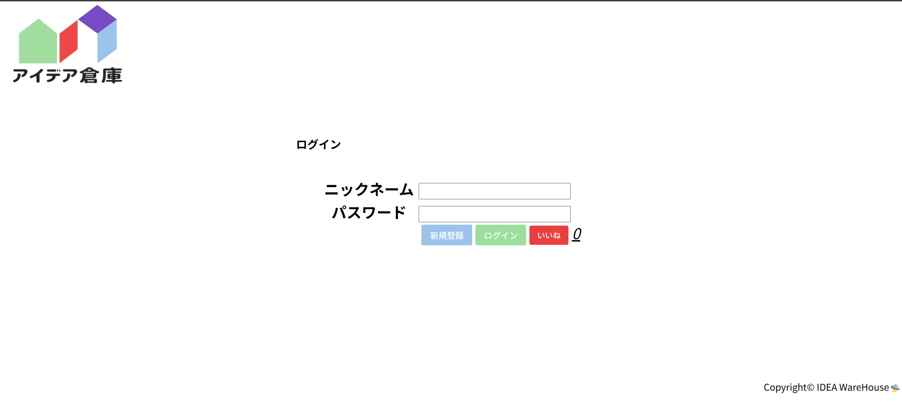
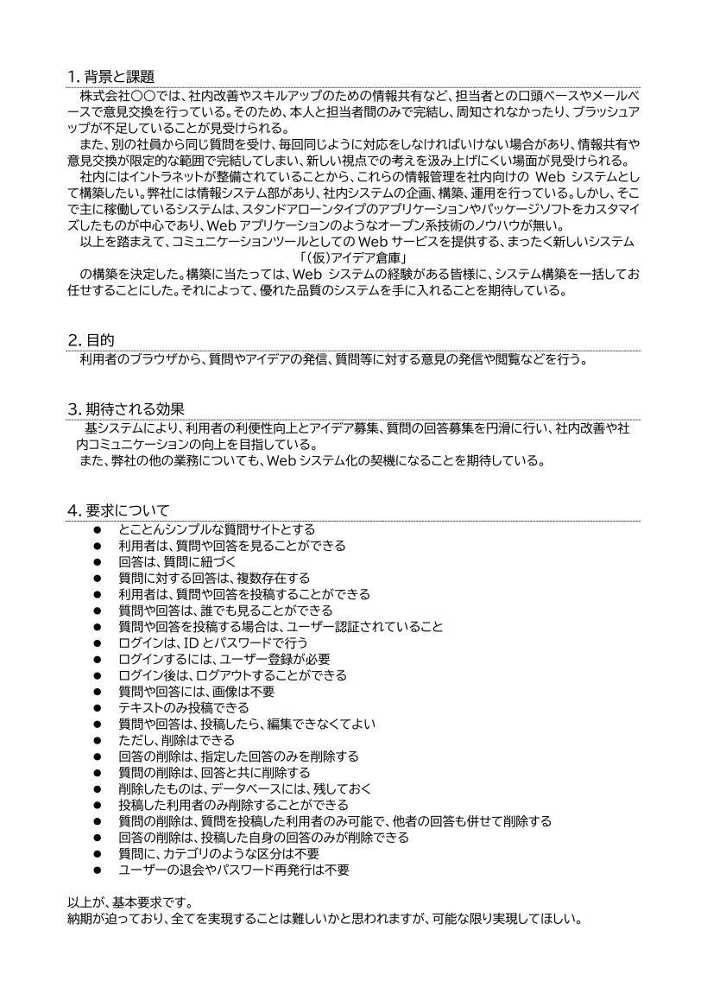
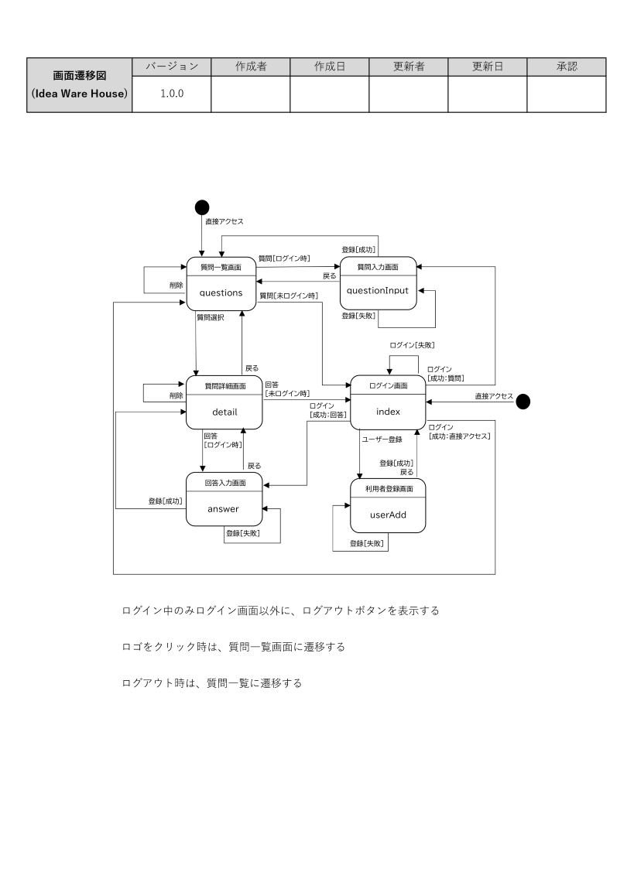
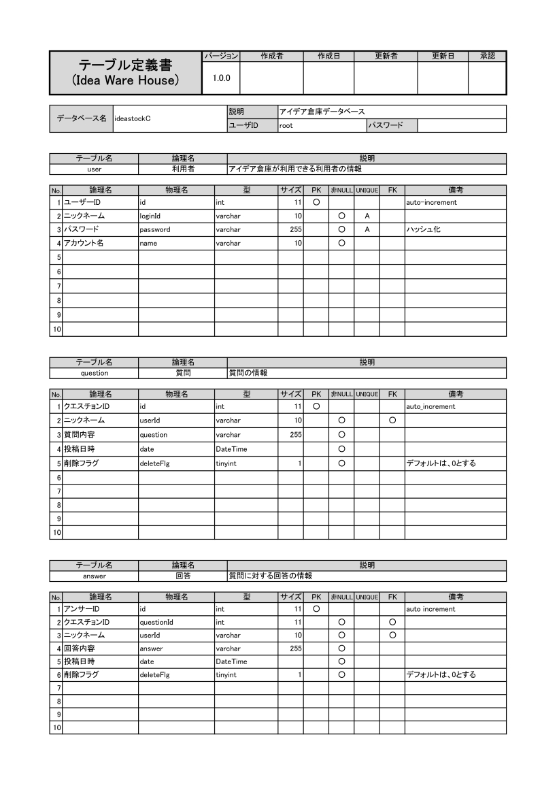
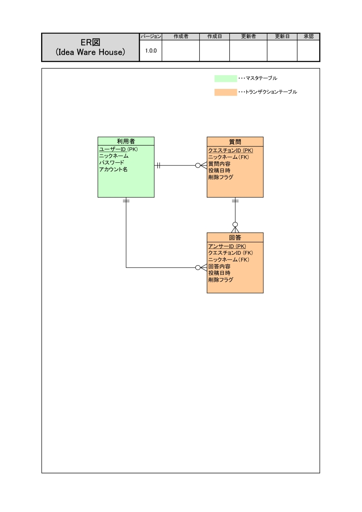

<h1 align="center">Idea Ware House</h1>

 

## 概要

会員制の掲示板サイトです。初めてのチーム演習（職業訓練）で制作したものです。

 

## 使用技術

- PHP 8.2.4
- MySQL 8.0.13

 

## 設計等

| 要求定義 | 画面遷移図 |
| :---: | :---: |
|  |  |

 

| テーブル定義 | ER図 |
| :---: | :---: |
|  |  |

 

## その他

ワイヤーフレームからのデザイン作成やWBS・ガントチャートによるタスク管理など、慣れないことばかりでしたが新鮮でした。 
クッキーとセッションの違いからXSSやCSRF対策など、セキュリティに対する考え方も変わりました。 
パスワードのハッシュ化やページング処理など、要件以外のことにも挑戦しました。
